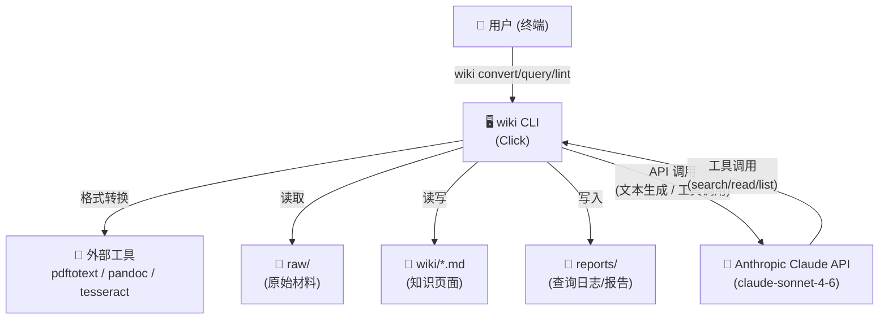

<!-- BEGIN:architecture -->
# LLM Wiki — 架构文档

## 项目概述

- **问题域**: 个人知识管理 — 将原始材料（PDF、DOCX、HTML、图片等）通过 LLM 自动转换为结构化 wiki 页面，支持智能查询和健康检查。
- **主要用户**: 个人知识工作者，通过 CLI 与 Anthropic Claude API 交互来构建和查询知识库。
- **项目类型**: Python CLI 工具（命令行应用）

## 技术栈

- **语言**: Python >= 3.11
- **CLI 框架**: Click >= 8.0
- **LLM SDK**: Anthropic Python SDK >= 0.40
- **HTTP**: httpx (支持 SOCKS 代理)
- **构建工具**: setuptools (pyproject.toml)
- **外部依赖**: pdftotext (PDF 转换), pandoc (富文本转换), tesseract (图片 OCR)
- **运行环境**: macOS/Linux 终端，需要 ANTHROPIC_API_KEY 环境变量

## 架构模式

**模块化 CLI + 管线 + Agentic Tool-Calling**

整体为单体 CLI 应用，内部按职责分为三层：

1. **CLI 层** (`cli.py`): Click 命令定义，参数解析，流程编排
2. **业务逻辑层** (`convert.py`, `query.py`, `llint.py`, `planner.py`, `executor.py`): 核心操作管线
3. **基础设施层** (`llm.py`, `config.py`, `tools.py`, `tracker.py`, `models.py`): API 封装、配置、共享工具

两种核心工作流模式：
- **标准管线**: 5 阶段顺序执行（convert → extract → generate → xref → index）
- **Plan-and-Execute**: 大文档先分析结构生成 DAG，再按拓扑序并行执行各章节，最后合并去重

## 核心模块 (一级)

| 模块 | 文件 | 职责 |
|------|------|------|
| CLI 入口 | `cli.py` | 4 个 Click 命令 (init/convert/query/lint) 的定义和参数解析 |
| 配置管理 | `config.py` | 从环境变量加载 Config 数据类，支持多目录路径和参数覆盖 |
| LLM 封装 | `llm.py` | Claude API 的三层调用接口（单次/JSON/工具循环）+ 终端 spinner（含 MultiSpinner ContextVar 并行协调） |
| 格式转换 | `convert.py` | 多格式→纯文本 + 5 阶段标准 ingest 管线 + 交叉引用刷新 |
| 文档规划 | `planner.py` | 大文档结构分析、DAG 构建与验证、章节拆分 |
| 并行执行 | `executor.py` | ThreadPoolExecutor 按 DAG 拓扑级并行处理章节，含去重和合并 |
| 知识查询 | `query.py` | Agentic 工具调用查询流程（搜索→阅读→合成→记录） |
| 共享工具 | `tools.py` | search_wiki / read_page / list_pages 的工具定义和实现 |
| 结构检查 | `llint.py` | 静态检查（断链、孤立页面、交叉引用密度）+ LLM 增强分析 |
| 数据模型 | `models.py` | Chapter、Plan、ChapterResult 数据类 |
| 用量追踪 | `tracker.py` | Token 用量记录、分阶段聚合、Markdown/HTML 报告生成 |

## 关键路径

```
CLI 启动流:
  cli.py:cli() (Click group)
    → config.py:load_config() (读取 ANTHROPIC_API_KEY 等环境变量)
    → 路由到具体命令处理函数

标准 Ingest 流 (wiki convert <file>):
  cli.py:convert()
    → convert.py:run_convert() (5 阶段管线)
      → Phase 1: convert_file() (格式→纯文本)
      → Phase 2: extract_concepts() (LLM 工具调用：搜索+阅读+决策)
      → Phase 3: generate_pages() (LLM 生成/合并页面)
      → Phase 4: run_cross_references() (基于 brief 的图谱 + 交叉引用)
      → Phase 5: update_index_and_log() (更新索引和日志)

大文档 Ingest 流 (自动检测或 --large):
  cli.py:convert()
    → auto-detect: 检查 text 长度 > config.large_threshold (默认 30,000 字符)
    → planner.py:plan_document() (LLM 分析结构→Plan)
    → planner.py:split_chapters() (按 heading pattern 拆分)
    → executor.py:execute_plan() (DAG 拓扑序并行执行)
      → _process_chapter() per chapter (Phase 2-3, 带页面锁)
    → executor.py:merge_all_results() (去重→交叉引用→索引日志)

查询流 (wiki query <question>):
  cli.py:query()
    → query.py:run_query()
      → llm.py:call_claude_with_tools() (LLM 循环调用 search/read/list)
      → 记录到 reports/queries.md + wiki/log.md

Lint 流 (wiki lint [--model X]):
  cli.py:lint()
    → llint.py:run_lint()
      → 静态检查: 必要文件、断链、孤立页面、交叉引用密度、矛盾标记
      → 可选 LLM 增强: 内容矛盾、重复、缺失概念、弱结论
```

## 配置驱动的逻辑

| 环境变量 | 默认值 | 影响行为 |
|----------|--------|----------|
| `ANTHROPIC_API_KEY` | (必填) | Claude API 认证，未设置则退出 |
| `WIKI_MODEL` | `claude-sonnet-4-6` | 所有 LLM 调用使用的模型 |
| `ANTHROPIC_BASE_URL` | (Anthropic 默认) | 自定义 API 端点（代理/中转） |
| `WIKI_DIR` | `wiki` | wiki 页面输出目录 |
| `RAW_DIR` | `raw` | 原始材料存储目录 |
| `REPORTS_DIR` | `reports` | 报告输出目录 |
| `TEMPLATES_DIR` | `templates` | 页面模板目录 |
| `WIKI_MAX_WORKERS` | `4` | 大文档并行处理的最大线程数 |
| `WIKI_LARGE_THRESHOLD` | `30000` | 自动切换 plan-and-execute 的字符数阈值 |

CLI 参数覆盖: `--model` 覆盖 `WIKI_MODEL`，`--workers` 覆盖 `WIKI_MAX_WORKERS`，`--large`/`--no-large` 覆盖自动检测。

## 系统上下文图


<!-- END:architecture -->
