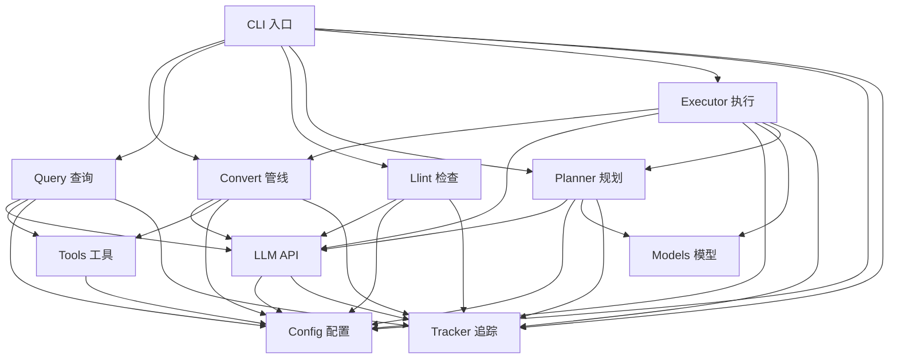

# LLM Wiki — 模块文档索引

## 项目简介

一行总结: 基于 LLM 的个人知识管理 CLI 工具——将原始材料自动转换为结构化 wiki 页面，支持智能查询。

## 关键统计

- 第一级模块数: 11
- 总公开接口数: 50+
- 关键外部依赖: Click (CLI 框架), Anthropic SDK (LLM API), pdftotext/pandoc/tesseract (格式转换)

## 系统架构概览

三层架构: **CLI 层** (cli.py) → **业务逻辑层** (convert, query, llint, planner, executor) → **基础设施层** (llm, config, tools, tracker, models)。

CLI 层负责命令解析和流程编排，业务逻辑层实现 5 阶段 ingest 管线/agentic 查询/结构检查/并行执行，基础设施层提供 API 封装、配置管理、共享工具和数据模型。

---

<!-- BEGIN:module-index -->
## 模块索引

| 模块名 | 文档路径 | 主要责任 | 依赖模块 |
|--------|---------|---------|---------|
| CLI | [cli.md](cli.md) | Click 命令行入口，4 个命令的流程编排 | config, tracker, convert, planner, executor, query, llint |
| Config | [config.md](config.md) | 环境变量 → Config 数据类 | None (基础模块) |
| LLM | [llm.md](llm.md) | Claude API 三层封装 + spinner | config, tracker |
| Convert | [convert.md](convert.md) | 格式转换 + 5 阶段 ingest 管线 + 交叉引用 | config, llm, tools, tracker |
| Planner | [planner.md](planner.md) | 大文档结构分析 + DAG 构建 | config, llm, models, tracker |
| Executor | [executor.md](executor.md) | DAG 拓扑级并行执行引擎 | config, convert, llm, models, planner, tracker |
| Query | [query.md](query.md) | Agentic 工具调用查询 | config, llm, tools, tracker |
| Tools | [tools.md](tools.md) | 共享 wiki 工具定义和实现 | config |
| Llint | [llint.md](llint.md) | Wiki 结构健康检查（静态 + LLM） | config, llm, tracker |
| Tracker | [tracker.md](tracker.md) | Token 用量追踪和报告生成 | None (基础模块) |
| Models | [models.md](models.md) | Chapter/Plan/ChapterResult 数据类 | None (叶子模块) |
<!-- END:module-index -->

---

<!-- BEGIN:dependency-graph -->
## 依赖关系图

**说明**:
- **Config** 和 **Tracker** 是最底层基础模块，被几乎所有其他模块依赖
- **Models** 是纯数据叶子模块，仅被 Planner 和 Executor 依赖
- **CLI** 是唯一入口点，不导出给其他模块使用
- **Executor** 是耦合度最高的模块（依赖 6 个模块），因为它编排整个大文档管线
- **Tools** 独立于 LLM，仅依赖 Config，保持工具逻辑与 API 调用分离
- 无循环依赖
<!-- END:dependency-graph -->

---

<!-- BEGIN:interface-index -->
## 全局接口索引

### CLI 入口 (cli.py)
- `cli(ctx, project_root)` → Click group
- `init(ctx)` → 初始化 wiki 目录结构
- `convert(ctx, target, ...)` → Ingest 文件/目录
- `lint(ctx, strict, model, ...)` → 结构健康检查
- `query(ctx, question, ...)` → 知识查询

### 配置管理 (config.py)
- `Config` (dataclass) — 运行时配置
- `load_config(project_root)` → `Config`
- `DEFAULT_MODEL = "claude-sonnet-4-6"`

### LLM API (llm.py)
- `call_claude(config, system, user)` → `str`
- `call_claude_json(config, system, user)` → `dict | list`
- `call_claude_with_tools(config, system, user, tools, execute_tool)` → `str`
- `MultiSpinner` (class) — 并行 spinner

### 格式转换与管线 (convert.py)
- `convert_file(path)` → `str` — 11 种格式 → 纯文本
- `run_convert(config, target, title)` → `list[Path]`
- `extract_concepts(config, text, filename)` → `(list[dict], list[dict])`
- `generate_pages(config, concepts, text, filename)` → `list[(Path, dict)]`
- `run_cross_references(config)` → `None`
- `parse_frontmatter(content)` → `dict[str, str]`
- `slugify(name)` → `str`

### 文档规划 (planner.py)
- `plan_document(config, text, filename)` → `Plan`
- `save_plan(plan, config)` → `Path`
- `load_plan(plan_path)` → `Plan`
- `split_chapters(full_text, chapters)` → `dict[str, str]`
- `describe_plan(plan)` → `str`

### 并行执行 (executor.py)
- `execute_plan(config, plan, full_text, max_workers)` → `list[ChapterResult]`
- `merge_all_results(config, results, plan)` → `None`

### 知识查询 (query.py)
- `run_query(config, question)` → `str`

### 共享工具 (tools.py)
- `TOOLS` (constant) → `list[dict]` — Anthropic 工具定义
- `search_wiki(config, query)` → `str`
- `read_page(config, name)` → `str`
- `list_pages(config)` → `str`
- `make_executor(config)` → `Callable`

### 结构检查 (llint.py)
- `run_lint(config, use_llm, strict)` → `LintResult`
- `LintResult` (dataclass) — 检查结果

### Token 追踪 (tracker.py)
- `TokenTracker` (class) — 核心追踪器
- `get_tracker()` → `TokenTracker`
- `effective_input_tokens(usage)` → `int`

### 数据模型 (models.py)
- `Chapter` (dataclass) — 章节元数据
- `Plan` (dataclass) — 执行计划
- `ChapterResult` (dataclass) — 执行结果
<!-- END:interface-index -->

---

## 交叉引用一致性检查

| 检查项 | 状态 | 说明 |
|--------|------|------|
| 引用完整性 | ✅ | 所有模块声明的依赖关系均与实际 import 一致 |
| 循环依赖 | ✅ | 无循环依赖：依赖图是纯 DAG |
| 孤立模块 | ✅ | 所有模块至少被一个其他模块依赖（或被 CLI 命令调用） |
| 接口覆盖 | ✅ | 全局接口索引覆盖了所有模块的主要公开函数 |
